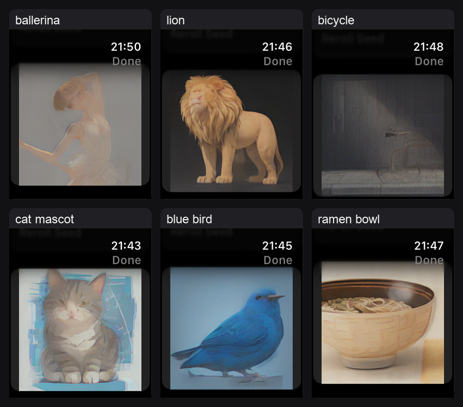

# Tiny Watch Image Generator

Apple Watch 上でローカル画像生成を試すための実験リポジトリです。

現在の採用ベースラインは `WatchPipelineSmokeApp` の `LCM256 6b`
パイプラインです。Watch 上で短い自由入力プロンプトを CLIP text
encoder に通し、16分割した LCM UNet と 256px decoder を CPU-only Core
ML で順番に実行します。

一方で、最初の純 Swift MLP 方式や Core ML stress test も残しています。
用途が違うので、後から見返しやすいように3つのトラックとして扱います。
More detail: [docs/project_tracks.md](docs/project_tracks.md).

## Track Map

| Track | Purpose | Main entry points | Status |
| --- | --- | --- | --- |
| Original MLP | Core ML なしで即ビルドできる軽量 Watch demo と Swift 評価基盤 | `TinyImageWatchApp`, `Sources/TinyWatchGenerator`, `TinyPreview`, `TinyWatchEval` | Legacy / UI and baseline reference |
| Core ML Stress | Watch の Core ML load/predict/memory ceiling と text encoder 単体確認 | `WatchStressTestApp`, `WatchTextEncoderSmokeApp`, `schemes/watch_sd_quantization/` | Probe / diagnostics |
| Diffusion LCM256 | 現在の最高品質 Watch txt2img baseline | `WatchPipelineSmokeApp`, `LCM256Assets`, `TextEncoderAssets`, `tools/watch_lcm256_quality_eval.py` | Adopted baseline |

## Which Scheme To Run

- `TinyImageWatchApp`: 依存モデルなしで動く最初の MLP デモ。clone 後すぐ
  Simulator で動かしたいとき。
- `WatchStressTestApp`: Core ML モデル単体のロード/推論/メモリ確認。
- `WatchTextEncoderSmokeApp`: text encoder だけを分離実行する probe。
- `WatchPipelineSmokeApp`: 現在の LCM256 画像生成 baseline。

All schemes live in:

```sh
open watchos_example/TinyImageWatchApp.xcodeproj
```

## Diffusion Baseline

`WatchPipelineSmokeApp` is the current quality path:

- Pipeline: `LCM256 6b`
- Resolution: `256x256`
- Prompt conditioning: transient CLIP text encoder on Watch
- UNet: 16 streamed 6-bit chunks
- Decoder: 256px 4-bit VAE decoder
- Guidance: `6`
- Seed: random by default, with reroll as the normal exploration path
- Preview: direct `Smooth` 256px display
- Compute: CPU-only Core ML

The app UI is intentionally small: prompt input, generate/reroll button, and the
generated image. Pipeline details stay in Xcode console logs with the
`[WatchPipeline]` prefix.

Compiled `.mlmodelc` bundles are intentionally ignored by Git. The repository
tracks source, scheduler/prompt/tokenizer metadata, docs, and verification
scripts. Large model packages are local artifacts under `dist/` and compiled
app resources under:

```text
watchos_example/WatchPipelineSmokeApp/Models/
watchos_example/WatchPipelineSmokeApp/TextEncoderAssets/
```

Download the current external model artifacts from Hugging Face before building
`WatchPipelineSmokeApp`:

```sh
python3 tools/fetch_watch_lcm256_assets.py
```

The artifact repo is:

- [lube8163/tiny-watch-image-generator-lcm256-coreml](https://huggingface.co/lube8163/tiny-watch-image-generator-lcm256-coreml)

For Mac-side quality evaluation or model rebuild work, also install the
`.mlpackage` files:

```sh
python3 tools/fetch_watch_lcm256_assets.py --packages
```

Useful docs:

- [docs/watch/watch_256_baseline_summary_2026-06-23.md](docs/watch/watch_256_baseline_summary_2026-06-23.md)
- [docs/watch/pipeline_smoke_current.md](docs/watch/pipeline_smoke_current.md)
- [docs/watch/mac_quality_eval.md](docs/watch/mac_quality_eval.md)
- [docs/watch/mac_quality_eval_full_summary_2026-06-24.md](docs/watch/mac_quality_eval_full_summary_2026-06-24.md)

## Device Validation Notes

Latest manual device checks used:

- Device: Apple Watch Series 11 (GPS)
- OS: watchOS 26.5
- Build host: Mac mini (M2, 8GB)
- Xcode: 26.5 (17F42)
- Watch free storage at test time: about 44GB
- Installed app size: 1.57GB after deleting the app and rebuilding
- Observed generation time: 53.8s to 62.8s per 256px image, average 56.7s
  across six prompts in the latest log
- Observed memory peak in the 256px path: about 140MB in previous device runs
- Battery: not instrumented; subjective short-run observation was roughly
  around 1% per generated image
- Thermal: not instrumented, but the Watch did not feel hot while worn during
  short manual generation sessions

Latest device screenshots:



Physical-device Xcode builds are slow because the Watch app carries large
compiled Core ML assets. Expect install/build cycles to take more than 10
minutes, and on some environments a clean install may need a retry. If an
install appears wedged, deleting the Watch app and rebuilding from Xcode has
been the most reliable reset.

For manual generation checks, keep the app launched from Xcode when possible.
When launched standalone on the Watch, the display can turn off before a full
generation completes, and watchOS may suspend or kill the app. A code-level
mitigation may be possible, but the current baseline treats Xcode-attached runs
as the reliable validation path.

## Mac Quality Eval

Mac-side quality evaluation uses the same scheduler, prompt expansion,
tokenizer, text encoder package, UNet package, decoder package, guidance, and
seed rule as the Watch path. It is for broad quality ranking, not for final
Watch runtime/memory validation.

Full 296-image suite:

```sh
.venv/bin/python tools/watch_lcm256_quality_eval.py \
  --out-dir reports/watch_lcm256_quality/full_lcm256_g6
```

The current full run completed with 296/296 images and 0 failures. Generated
images, manifests, and contact sheets stay under ignored `reports/`.

## Original MLP Quick Start

The original pure Swift MLP demo needs no Core ML models:

```sh
open watchos_example/TinyImageWatchApp.xcodeproj
```

Select:

- Scheme: `TinyImageWatchApp`
- Destination: an Apple Watch Simulator

CLI Simulator build:

```sh
xcodebuild \
  -project watchos_example/TinyImageWatchApp.xcodeproj \
  -scheme TinyImageWatchApp \
  -destination 'generic/platform=watchOS Simulator' \
  CODE_SIGNING_ALLOWED=NO \
  build
```

SwiftPM preview:

```sh
swift run TinyPreview 7 cat > /tmp/cat.ppm
swift run TinyPreview --raw 7 cat > /tmp/cat_raw.ppm
```

MLP contact sheet:

```sh
python3 tools/make_watch_eval_contact_sheet.py \
  --groups core_nouns,adjectives,actions,styles,japanese_aliases \
  --prompts-per-group 2 \
  --seeds 0
```

## Core ML Stress Tests

Stress/probe targets are for feasibility checks, not for the final user flow:

- `WatchStressTestApp`: scans bundled `.mlmodelc` models and logs load/predict
  behavior with `[WatchStress]`.
- `WatchTextEncoderSmokeApp`: runs the separated text encoder load/predict/release
  cycle when the encoder needs to be checked in isolation.

Historical stress notes:

- [schemes/watch_sd_quantization/README.md](schemes/watch_sd_quantization/README.md)
- [docs/watch/text_encoder_smoke.md](docs/watch/text_encoder_smoke.md)

## Local Artifact Policy

These directories are intentionally local and ignored:

- `datasets/`
- `dist/`
- `models/`
- `out/`
- `reports/`

Keep prompt suites, scripts, source files, tokenizer metadata, scheduler JSON,
and docs in Git. Keep generated images, downloaded models, converted packages,
compiled `.mlmodelc` bundles, and large research outputs out of Git.
Current LCM256 artifacts are published separately on Hugging Face and can be
installed with `tools/fetch_watch_lcm256_assets.py`.

## Main Docs

- [docs/watch/README.md](docs/watch/README.md): Watch-specific index.
- [docs/watch/txt2img_plan.md](docs/watch/txt2img_plan.md): project direction.
- [docs/watch/future_quality_breakthroughs.md](docs/watch/future_quality_breakthroughs.md): larger quality-improvement paths.
- [docs/articles/tiny_watch_image_generator_progress_2026-06-14.md](docs/articles/tiny_watch_image_generator_progress_2026-06-14.md): earlier progress log.

## Troubleshooting

If Xcode asks for a development team when using Simulator:

- Make sure the selected destination is an Apple Watch Simulator.
- Clean build folder if Xcode reused a previous physical-device destination.

If a physical Watch build fails with signing errors:

- Select your own Team in `Signing & Capabilities`.
- Change the bundle identifier to a unique identifier you own.
- Ensure the Watch is paired and enabled for development.

If `TinyImageWatchApp` crashes with `TinyWeights.bin is missing from the app bundle`:

- Confirm `watchos_example/TinyImageWatchApp/TinyWeights.bin` exists.
- Confirm it appears in the target's Copy Bundle Resources phase.
